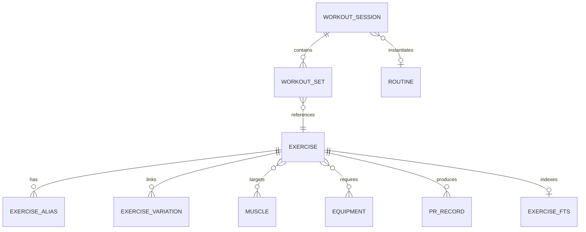

# FORGE — System Architecture & Technical Specification (ARCHITECTURE.md)

**Generated:** September 2026  
**Status:** Approved Architectural Specification (Phase 0 Corrections Incorporated)  
**Design Philosophy:** Clean Architecture, Offline-First, Local-First, Zero Cloud Reliance.

---

## 1. High-Level Architectural Layers

FORGE enforces strict separation between domain algorithms, persistence, and UI presentation:

```text
┌─────────────────────────────────────────────────────────────────────────┐
│                      PRESENTATION LAYER (Jetpack Compose)               │
│  - Shell Screens: Home, Workouts, Progress, Journey, Profile            │
│  - ViewModels: GymSessionVM, ProgramVM, SearchVM, AnalyticsVM           │
│  - Semantic Design System: ForgeTheme, Semantic Tokens, Monospace Cues  │
└────────────────────────────────────┬────────────────────────────────────┘
                                     │ (StateFlow / UI Events)
                                     ▼
┌─────────────────────────────────────────────────────────────────────────┐
│                        DOMAIN LAYER (Pure Kotlin)                       │
│  - Progression Engine      - Physique Engine      - Program Engine      │
│  - Recovery Engine         - Exercise Matcher     - Text/Voice Parser   │
│  - 1RM Estimator & Volume  - Time-Adaptive Sched  - Deload Evaluator    │
│  * ZERO Android framework imports. 100% testable on pure Mac JVM.       │
└────────────────────────────────────┬────────────────────────────────────┘
                                     │ (Repository Interfaces)
                                     ▼
┌─────────────────────────────────────────────────────────────────────────┐
│                          DATA LAYER (Local Persistence)                 │
│  - Room Database (SQLite with FTS4 Virtual Tables)                      │
│  - Explicit, Versioned Database Migrations with Automated Tests         │
│  - Scoped Local Storage (Physique Photos, JSON Exports, ZIP Archives)   │
│  - DataStore Preferences (App Config, Equipment Profile)                │
└────────────────────────────────────┬────────────────────────────────────┘
                                     │
                                     ▼
┌─────────────────────────────────────────────────────────────────────────┐
│                       INTEGRATIONS & PLATFORM LAYER                     │
│  - Health Connect Client (Native Android Sync, Optional)                │
│  - Android SpeechRecognizer (Native on-device Voice Logging)            │
│  - ML Kit Text Recognition (On-device OCR Import)                       │
│  - BiometricManager (Hardware App Lock)                                 │
│  - CameraX (Physique Photo Standardized Guides)                         │
└─────────────────────────────────────────────────────────────────────────┘
```

---

## 2. Semantic Design Tokens

To prevent hard-coded color fragmentation and allow visual evolution without refactoring screens, all UI styling uses semantic design tokens:

```kotlin
data class ForgeColors(
    val background: Color,         // Deep canvas (OLED `#0A0B0E`)
    val surface: Color,            // Card / container baseline (`#14161D`)
    val surfaceElevated: Color,    // Active card / elevated modal (`#1E212B`)
    val primary: Color,            // Core brand athletic accent (`#00E5FF`)
    val secondary: Color,          // Tactical highlight (`#FFB300`)
    val accent: Color,             // Secondary interactive accent (`#7C4DFF`)
    val textPrimary: Color,        // High-contrast primary reading text (`#F0F2F5`)
    val textSecondary: Color,      // Dimmed labels, units, cues (`#8A909E`)
    val success: Color,            // Set completed, PR achieved (`#00E676`)
    val warning: Color,            // High fatigue alert, deload suggested (`#FFD600`)
    val error: Color,              // Form failure, invalid entry (`#FF5252`)
    val divider: Color             // Subtle structural separators (`#232733`)
)
```

Provided throughout Compose via:
```kotlin
val LocalForgeColors = staticCompositionLocalOf<ForgeColors> { error("No ForgeColors provided") }

object ForgeTheme {
    val colors: ForgeColors
        @Composable
        get() = LocalForgeColors.current
}
```

---

## 3. Extensible Exercise Database Schema

The database schema is designed to be fully extensible across all planned phases:

### 3.1 Entity Relationship Diagram



### 3.2 Extensible Table Definitions

#### `exercises` & `exercises_fts`
```sql
CREATE TABLE exercises (
    id TEXT PRIMARY KEY NOT NULL, -- e.g. "barbell_bench_press"
    name TEXT NOT NULL,
    canonical_name TEXT NOT NULL,
    movement_pattern TEXT NOT NULL, -- PUSH, PULL, SQUAT, HINGE, LUNGE, CARRY, ISOLATION
    mechanic TEXT NOT NULL, -- COMPOUND, ISOLATION
    force_type TEXT NOT NULL, -- PUSH, PULL, STATIC
    experience_level TEXT NOT NULL, -- BEGINNER, INTERMEDIATE, ADVANCED
    instructions TEXT NOT NULL, -- JSON array of strings
    form_cues TEXT NOT NULL, -- JSON array of strings
    common_mistakes TEXT NOT NULL, -- JSON array of strings
    youtube_video_id TEXT, -- Optional YouTube video reference
    is_custom INTEGER NOT NULL DEFAULT 0, -- 1 for user-created custom exercises
    created_at INTEGER NOT NULL,
    updated_at INTEGER NOT NULL
);

-- FTS4 Virtual Table for Instant Search
CREATE VIRTUAL TABLE exercises_fts USING fts4(
    content='exercises',
    name,
    movement_pattern,
    instructions,
    tokenize=unicode61
);
```

#### `exercise_aliases` & `exercise_variations`
```sql
CREATE TABLE exercise_aliases (
    id INTEGER PRIMARY KEY AUTOINCREMENT NOT NULL,
    exercise_id TEXT NOT NULL,
    alias TEXT NOT NULL,
    FOREIGN KEY(exercise_id) REFERENCES exercises(id) ON DELETE CASCADE
);
CREATE INDEX idx_exercise_aliases_name ON exercise_aliases(alias);

CREATE TABLE exercise_variations (
    id TEXT PRIMARY KEY NOT NULL,
    canonical_exercise_id TEXT NOT NULL,
    variation_exercise_id TEXT NOT NULL,
    variation_type TEXT NOT NULL, -- GRIP, ANGLE, TEMPO, RESISTANCE_PROFILE
    notes TEXT,
    FOREIGN KEY(canonical_exercise_id) REFERENCES exercises(id) ON DELETE CASCADE,
    FOREIGN KEY(variation_exercise_id) REFERENCES exercises(id) ON DELETE CASCADE
);
```

#### `workout_sessions` & `workout_sets` (Transactional Crash Recovery Model)
```sql
CREATE TABLE workout_sessions (
    id TEXT PRIMARY KEY NOT NULL,
    routine_id TEXT,
    program_version_id TEXT,
    start_time INTEGER NOT NULL,
    end_time INTEGER,
    status TEXT NOT NULL, -- 'IN_PROGRESS', 'COMPLETED', 'DISCARDED'
    active_exercise_id TEXT,
    active_set_index INTEGER NOT NULL DEFAULT 0,
    rating INTEGER,
    readiness_score INTEGER,
    total_volume_kg REAL NOT NULL DEFAULT 0.0,
    duration_seconds INTEGER NOT NULL DEFAULT 0,
    notes TEXT,
    last_updated_at INTEGER NOT NULL
);
CREATE INDEX idx_workout_sessions_status ON workout_sessions(status);

CREATE TABLE workout_sets (
    id TEXT PRIMARY KEY NOT NULL,
    session_id TEXT NOT NULL,
    exercise_id TEXT NOT NULL,
    set_order INTEGER NOT NULL,
    set_type TEXT NOT NULL, -- WARMUP, NORMAL, DROPSET, FAILURE, MYOREP
    weight_kg REAL NOT NULL,
    reps INTEGER NOT NULL,
    rpe REAL,
    rir INTEGER,
    tempo TEXT,
    rest_seconds_taken INTEGER,
    is_completed INTEGER NOT NULL DEFAULT 0,
    is_personal_record INTEGER NOT NULL DEFAULT 0,
    completed_at INTEGER,
    FOREIGN KEY(session_id) REFERENCES workout_sessions(id) ON DELETE CASCADE,
    FOREIGN KEY(exercise_id) REFERENCES exercises(id) ON DELETE RESTRICT
);
CREATE INDEX idx_sets_session ON workout_sets(session_id, set_order);
```

---

## 4. Single-Source-of-Truth Crash Recovery Protocol

Instead of maintaining a separate JSON snapshot that risks state divergence, the relational database is the sole source of truth:

1. **Transactional Write Pipeline:**
   Every set check, weight modification, or exercise addition executes in a Room `@Transaction`:
   ```kotlin
   @Transaction
   suspend fun logSet(session: WorkoutSessionEntity, set: WorkoutSetEntity) {
       insertOrUpdateSet(set)
       updateSessionState(
           sessionId = session.id,
           activeExerciseId = set.exerciseId,
           activeSetIndex = set.setOrder + 1,
           lastUpdatedAt = System.currentTimeMillis()
       )
   }
   ```
2. **Cold Launch Inspection:**
   When the app opens, `WorkoutRepository.getActiveSession()` queries:
   `SELECT * FROM workout_sessions WHERE status = 'IN_PROGRESS' ORDER BY start_time DESC LIMIT 1`.
3. **Deterministic State Reconstruction:**
   If found:
   - Sets are queried via `getSetsForSession(session.id)`.
   - Completed sets are identified via `is_completed == 1`.
   - Active exercise and next set are recovered directly from `active_exercise_id` and `active_set_index`.
   - User is prompted with: *"Resume active workout from [Start Time]?"* with complete state fidelity.

---

## 5. Explicit Database Migrations Strategy

Every schema change in FORGE requires an explicit, tested migration. Destructive fallback (`fallbackToDestructiveMigration()`) is **strictly forbidden**.

```kotlin
val MIGRATION_1_2 = object : Migration(1, 2) {
    override fun migrate(db: SupportSQLiteDatabase) {
        // Explicit SQL statements preserving all existing rows
    }
}
```

Automated migration tests using `androidx.room:room-testing` run on the JVM to verify schema upgrades from version to version without data loss.

---

## 6. Realistic Search Performance Standard

Rather than arbitrary "sub-millisecond" assertions, the search engine standard is defined as:
> **"Exercise search must feel instantaneous on a realistic database containing thousands of exercises and aliases."**

Search queries execute off the main thread via Room's asynchronous coroutine dispatchers. Benchmark testing will be executed on the physical Samsung Galaxy S21 FE 5G under realistic database sizes.
